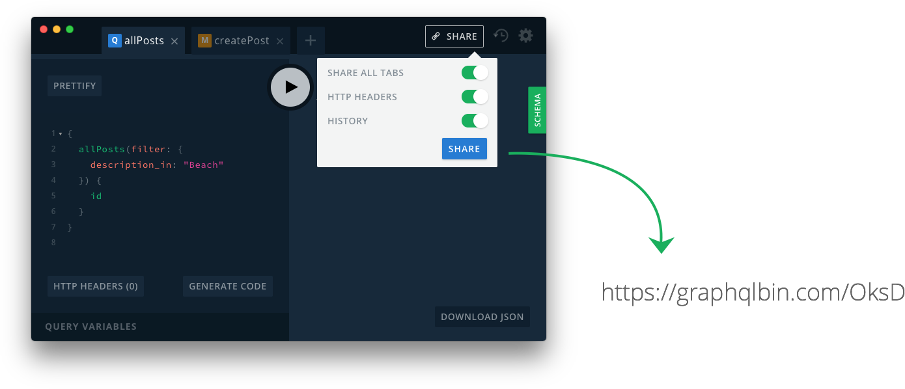

#### Describe the bug ####

A clear and concise description of what the bug is.

#### To Reproduce ####

Steps to reproduce the behavior. We prefer a GraphQL query or link to a graphqlbin to reproduce.

</a>

#### Expected behavior ####

A clear and concise description of what you expected to happen.

#### Screenshots ####

If applicable, add screenshots to help explain your problem.

#### Additional context ####

Add any other context about the problem here.
